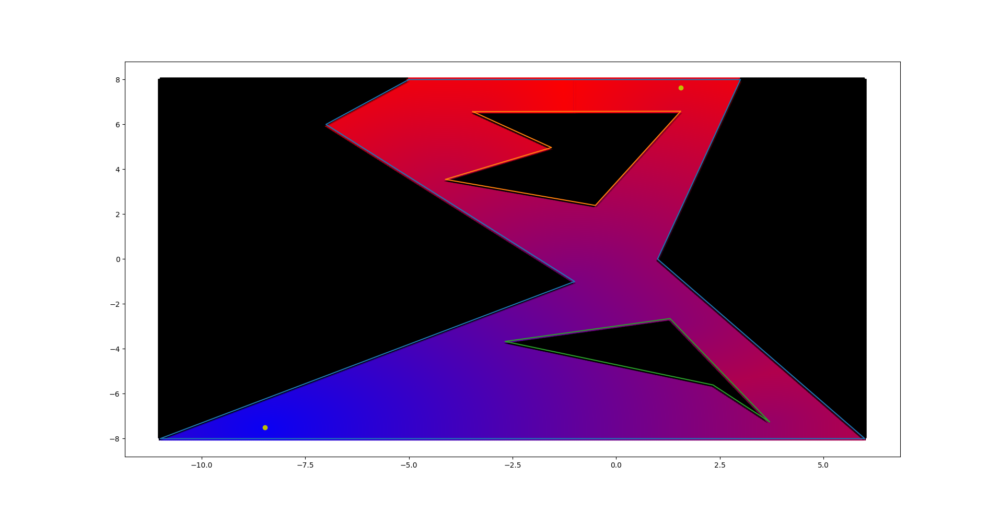
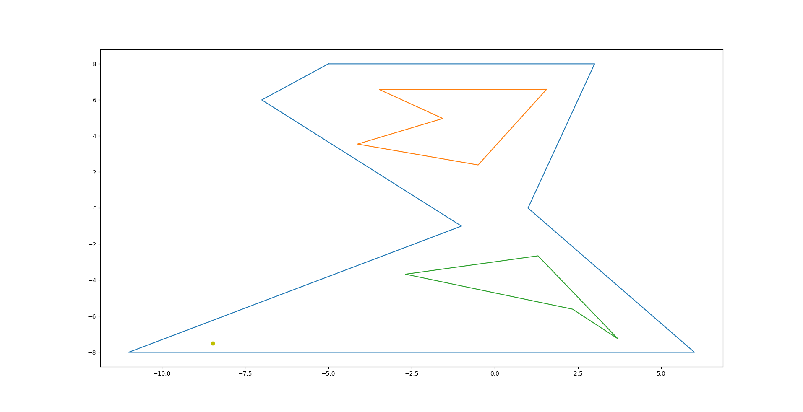

# CU_GEODESIC
*A CUDA-tool to compute the geodesic distance to many points in a polygon.*

## Table of Contents

 - [Geodesic Distance](#geodesic-distance)
 - [Building & Usage](#building--usage)
   - [Building](#building)
   - [Usage](#usage)
   - [Data File Format](#data-file-format)
   - [Output](#output)
   - [Plotter](#plotter)
 - [The Algorithm](#the-algorithm)
   - [Step 1: Computing the Graph](#step-1-computing-the-graph)
   - [Step 2: Running A*](#step-2-running-a)
   - [Step 3: Computing the Final Stretch](#step-3-computing-the-final-stretch)

## Geodesic Distance
The geodesic distance between two points P and Q in a polygon (with or without holes) is defined as *the length of the shortest path that connects P to Q, where every segment lies entirely within the polygon*.
In a convex polygon without holes, this distance will always simply be the Euclidean distance (as the direct path can't cross any edges).

Given a polygon and a starting point, this tool will compute the geodesic distance to a lot of points, trying to find the one that's the farthest away (if that sounds like a very specific use-case, it is).

## Building & Usage
### Building
The project is based on CMake, but requires the CUDA toolkit (to make a lot of computations run at the same time).
To build with CMake, you can use its interface. The simplest way is (Linux):
```sh
mkdir build && cd build && cmake .. && cmake --build .
```
This will build the application in the `./build` directory, as an executable binary called `cu_geodesic`.

### Usage  
```sh
build/cu_geodesic <data file> <core count> <granularity>
```
Where:
 - The data file is a file specifying the starting point, polygon and its holes; see later;
 - The core count is the number of CUDA threads that can be launched at the same time;
 - The granularity is the difference in x or y value between two points; if this value is too low, the farthest point will be incorrect.

If the granularity requires more points than there are cores, the runtime will make sure that they are run in batches (and will log the progress).
I've found that for reasonably big polygons (think specifying points up to two digits behind the decimal comma) a granularity of `1e-2` is small enough.

### Data File Format
The binary expects a very specific, easy-to-parse and easy-to-read file format (if things are wrong, it will issue warnings):
 - The first line of the file contains 2 float values (parsed as C++ `double`): the x and y value of the starting points;
 - The second line contains a list of points on the boundary of the polygon formatted as `x1 y1;x2 y2;x3 y3;...`. All consecutive points are two-by-two connected by edges. There's an additional edge between the first and last points to close the polygon.
 - The next lines (if any) contain the holes in the polygon, each specified as a polygon boundary.

Some limitations and/or undefined behavior:
 - The algorithm can't handle points with a very similar x-location (due to `y = a*x + b` representation of line segments for intersections);
 - Two edges in the polygon shouldn't intersect each other - the only intersection points should be the vertices. This is not tested, so I'm calling it undefined behavior*;
 - Two holes shouldn't overlap; see above.
 - The holes should have a reasonable thickness - otherwise the algorithm will make mistakes. This can be fixed by scaling the figure up.

*) Side note: if you feel like implementing/testing the behavior, please do make a pull request :)

### Output
The binary spews out a lot of (debug) information while running; and most of this output can be safely ignored. 
Some more important points:
 - If a line starts with `[WARNING]:` or `[ERROR]:`, then usually something is wrong in the input. This might be important.
 - The binary generates some intermediary output to some files in the `/tmp/` directory (if possible). It also tells you where to look for those files (see the excerpt from the output below).
 - Lastly, the furthest point is logged along with its distance when it's calculated. This might be nice to know.

If everything goes well, running the binary on the `ex/hourglass.segm` file with `600` CUDA cores and a granularity of `1e-2` should result in this output:
```
[MESSAGE]: starting point is (x, y) = (-8.48, -7.49)
[MESSAGE]: polygon boundary has 7 segments.
[MESSAGE]:    -> segment(from=(-7,6), to=(-5,8), ax+b=1x+13)
[MESSAGE]:    -> segment(from=(-5,8), to=(3,8), ax+b=0x+8)
[MESSAGE]:    -> segment(from=(3,8), to=(1,0), ax+b=4x+-4)
[MESSAGE]:    -> segment(from=(1,0), to=(6,-8), ax+b=-1.6x+1.6)
[MESSAGE]:    -> segment(from=(6,-8), to=(-11,-8), ax+b=-0x+-8)
[MESSAGE]:    -> segment(from=(-11,-8), to=(-1,-1), ax+b=0.7x+-0.3)
[MESSAGE]:    -> segment(from=(-1,-1), to=(-7,6), ax+b=-1.16667x+-2.16667)
[MESSAGE]: bounding box ranges [xmin, xmax] = [-11, 6] and [ymin, ymax] = [-8, 8]
[MESSAGE]: polygon has 2 holes.
[MESSAGE]:     -> hole #0: (5 segments)
[MESSAGE]:       -> segment(from=(-1.56,4.97), to=(-3.46,6.57), ax+b=-0.842105x+3.65632)
[MESSAGE]:       -> segment(from=(-3.46,6.57), to=(1.56,6.59), ax+b=0.00398406x+6.58378)
[MESSAGE]:       -> segment(from=(1.56,6.59), to=(-0.5,2.39), ax+b=2.03883x+3.40942)
[MESSAGE]:       -> segment(from=(-0.5,2.39), to=(-4.12,3.55), ax+b=-0.320442x+2.22978)
[MESSAGE]:       -> segment(from=(-4.12,3.55), to=(-1.56,4.97), ax+b=0.554688x+5.83531)
[MESSAGE]:     -> hole #1: (4 segments)
[MESSAGE]:       -> segment(from=(2.34,-5.61), to=(3.7,-7.25), ax+b=-1.20588x+-2.78824)
[MESSAGE]:       -> segment(from=(3.7,-7.25), to=(1.3,-2.65), ax+b=-1.91667x+-0.158333)
[MESSAGE]:       -> segment(from=(1.3,-2.65), to=(-2.68,-3.67), ax+b=0.256281x+-2.98317)
[MESSAGE]:       -> segment(from=(-2.68,-3.67), to=(2.34,-5.61), ax+b=-0.386454x+-4.7057)
[KERNEL]: allocating GPU memory and copying data...
[KERNEL]: step one: starting GPU graph generation (attempting to use 16 CUDA threads)...
[KERNEL]: step one finished. GPU graph is generated.
[KERNEL]: outputting GPU graph adjacencies...
[KERNEL]: GPU graph adjacencies outputted to /tmp/adjacencies.txt.
[KERNEL]: step two: calculate geodesic distances from each vertex to the start...
[KERNEL]: step two finished.
[KERNEL]: cleaning up graph...
[KERNEL]: outputting geodesic distances to vertices...
[KERNEL]: geodesic distances outputted to /tmp/geodesic.csv.
[KERNEL]: step three: calculate geodesic distances to points...
[KERNEL]:   requiring 1700 steps in x-dimension, and 1600 in y-dimension; 2720000 steps in total
[KERNEL]:   ran 2719800/2720000 (99%) steps
[KERNEL]: step three finished.
[KERNEL]: step four: copy results to CPU...
[KERNEL]:   copied/checked 2719000/2720000 (99%) values.
[KERNEL]: step four finished. Farthest point is (1.56, 7.63); distance 21.2387.
[KERNEL]: computations done running. Cleaning up...
[KERNEL]: kernel finished running.
[MAIN]: starting output...
[MAIN]: using `../ex/hourglass.segm.csv' as output file.
[MAIN]:   Outputted 2719000/2720000 (99%) values.%    
```

In addition to the debug information, it also creates two files in the same directory of the input file:
 - `<input file>.meta` contains some meta-information about the results:
   ```
   farthest point: (1.56, 7.63)
   bounding box: ((x min, x max), (y min, y max)) = ((-11, 6), (-8, 8))
   ```
 - `<input file>.csv` contains the results of all calculated points in the format `point x,point y,distance`. This file is used by the plotter.

### Plotter
This repository also contains a Python 3.10 script to plot the CSV results of the binary (dependencies: `matplotlib`, `numpy` and `pandas`). 
Each point is drawn as a colored star (but the amount of points can make it look like a nice gradient), where blue is close to the start and red is farther away.
Points that are outside the polygon (or inside holes) are marked in black.
Additionally, the polygon and its holes are overlain on the gradient, and the starting point and farthest point are marked with a yellow circle.
To use this script, simply call `./plotter.py <input file>`, where the input file is the same file you passed to the binary.



PS: the plotter is very, very slow right now. If a Python guru could take a look and speed it up, I would be very thankful...

## The Algorithm
Ignoring I/O and preparation, the algorithm itself consists of three large steps.
These are recognizable in the terminal output from the binary (ignoring the last step, which just copies data from the GPU to the CPU and searches for the farthest point).

I've outlined the steps below. 

### Step 1: Computing the Graph
Given the polygon, we can compute a graph. 
The vertex set of this graph contains of all the points in the polygon (both on the boundary and used to define the holes).
For each pair of points, the edge between them is added if a) it does not cross any edge, and b) it is entirely within the polygon (so not outside or in a hole); and its weight corresponds to the Euclidean distance between both points.



In the above example, the following edges are invalid:
 - between (-11, -8) and (-7, 6); this edge is entirely outside the polygon,
 - between (2.34, -5.61) and (1.3, -2.65); this edge is entirely within a hole, 
 - between (-11, -8) and (3, 8); this edge crosses an edge of the polygon's boundary, and
 - between (-2.68, -3.67) and (6, -8); this edge crosses an edge of a hole.

*Why do we do this?* In Euclidean space, the shortest path between two points is a straight line, and we will have to follow along these shortest paths to find our way.

### Step 2: Running A*
Given the graph (and the polygon), we can start computing the distance from each graph vertex to the starting point (or the other way around).
If the line segment between the starting point and the graph vertex is a viable edge (i.e. entirely withing the polygon, no intersections, ...), then we use the Euclidean distance.
Otherwise, we rely on the observation that the shortest path will go from the starting point to a starting point within reach, and then use the edges of the graph.

This reduces the problem to get the distance to each graph vertex to the shortest path in a graph. 
We use A* to solve this problem (additionally, we don't use the starting point itself as it's not in the graph. Instead, we use all vertices reachable from the starting point).

*Why do we compute this?* It makes the next step easier, and avoids a lot of duplicate computations (as otherwise there would be a lot more A* runs).

### Step 3: Computing the Final Stretch
Now that all that's out of the way, we can start computing the last part: the distance to the point we're interested in (or the bunch of points that form our 'grid').
As there are quire some checks in this part, I'll just use some pseudocode to keep things structured.

```
final_stretch(start, end, graph, step_two, polygon):
 s = line_segment(start, end)                      # connect both with a straight line segment
 if is_inside(s, polygon):                         # check if the line segment is viable (i.e. inside the polygon)
   return distance(start, end)                     #   trivial case: we didn't need the graph
 else                                              # we can't use the straight line segment
   min = infinity                                  #   this will hold the minimum until now
   for each vertex v in graph:                     #   iterate over the graph
     s' = line_segment(v, end)                     #     again, create a line segment
     if is_inside(s', polygon):                    #     and test its viability
       if distance(v, end) + step_two[v] < min:    #       check if the (viable) edge makes for a shorter total path
         min = distance(v, end) + step_two[v]      #         if so, update the minimum
   return min                                      #    done like dinner
```